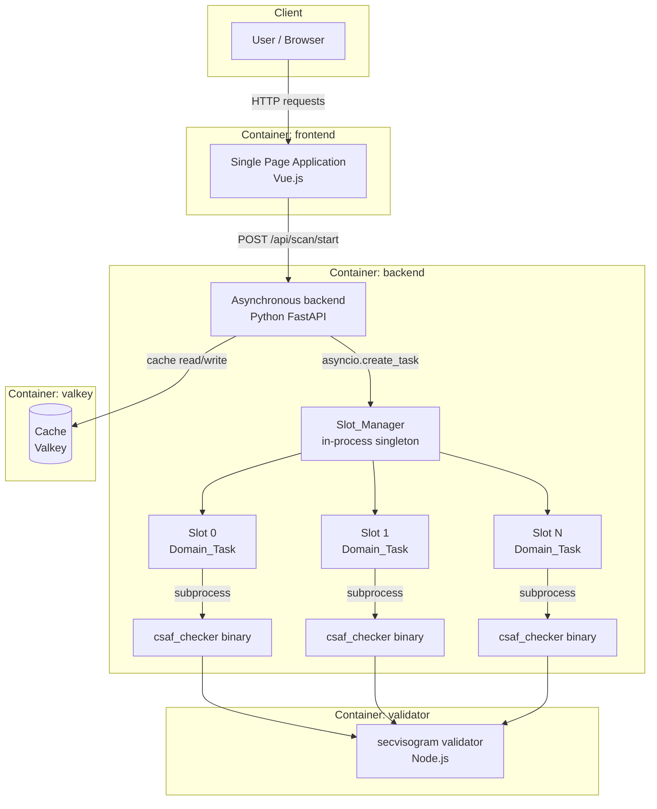

<!--
SPDX-FileCopyrightText: 2026 German Federal Office for Information Security (BSI) <https://www.bsi.bund.de>

SPDX-License-Identifier: Apache-2.0
-->

# csaf-tools/provider-online-check

## Introduction

A web application, which allows to check a CSAF trusted provider online.

Status: _early development_

Aim:

 * Help organizations to analyse and improve their own CSAF providers.
   Expected to be useful during the initial setup of a provider.

 * Check third party providers to see if they have problems
   (from time to time).

 * Make it easier to run the `csaf_checker`.


Considerations:

 * It is planned to offer this as a service (with limited resources).

 * Large CSAF providers will run this for themselves, e.g. using a prepared
   image for deployment.

 * When in doubt, too much stress on the CSAF Providers will be prevented.

## Getting started

### Get the repository

```shell
git clone https://github.com/csaf-tools/provider-online-check/
cd provider-online-check
```

### Running the Application

We recommend using Docker to start the services:

```shell
docker compose up -d
```

In the README files of `backend` and `frontend`, you can find instructions on the components and how to run them without Docker.

### Dev Makefile Targets

Common docker compose operations for the development environment are wrapped in make targets prefixed with `dev`.

For example, `make dev` runs `docker compose up --build`.

Run `make dev-help` to list all available dev targets.

## How to use

Visit http://localhost:48091/ in your browser.

## Developing

For local development with hot-reloading, use `docker compose up -d` which mounts the source directories into the containers. Changes to the code will be reflected immediately without rebuilding.

To run linting and tests, use the provided Makefile targets:

```shell
make lint      # Run black, isort, flake8 on backend code
make run-tests # Run pytest on backend tests
```

See the README files in [backend/](backend/) and [frontend/](frontend/) for component-specific development instructions.

### Frontend Testing / Coverage

To test/coverage the frontend, start the dev container and use the commands:
```shell
make run-fe-tests-containerd
make run-fe-coverage-containerd
```
or use one of the npm targets in the dev frontend container
```shell
make dev-enter frontend
npm run tests
npm run tests-single
npm run coverage
npm run coverage-single
```

### Making a new release

The version number must adhere to [semantic versioning 2.0.0](https://semver.org/).

* In `.env` set `APP_VERSION` to the new release version
* In `frontend/package.json` set the version (line 3) to the new release version
* Commit
* Make a Pull Request, request reviews
* Merge into branch `main`

Either in the GitHub web interface, or using the command line:

* `git tag -s $versionnumber` (the same as `APP_VERSION`)
* `git push`

Finally, create a release from the tag on GitHub.

* Generate the SBOMs with `make generate-sboms`.
* Upload them as attachments to the release.

## Architecture

The application consists of three main components:

- **Frontend**: A Vue.js 3 single-page application using Bootstrap for styling. It provides the user interface for initiating scans and viewing results.
- **Backend**: A FastAPI-based REST API that handles scan requests. It exposes endpoints for starting scans and checking status. The interactive API documentation is available at `/api/docs`.
- **Valkey**: Used as a message broker for the job queue, for asynchronous scan job processing.



## Security Considerations

The CSAF Provider Online check tool retrieves lots of documents from remote locations.
To minimize the impact on the network on the source and destination servers and networks, the tool provides settings for throttling and limiting the scanning.

Keep in mind, that the CSAF Provider Online check tool, and it's component (the CSAF Checker and Validator) process untrusted CSAF documents.
If testing untrusted CSAF providers, it is recommended to run the tool only in containers and with restricted network access.

## Dependencies

The CSAF Provider Online Check tool provides SBOMs in both CycloneDX and SPDX formats.
It covers dependencies for the backend, frontend and validator image.
The files are generated using syft (https://github.com/anchore/syft)

The files are regularly updated with each release.

To manually generate them, call the make target `make generate-sboms`.
The environment variable `GENERATED_FILE_PATH` determines the relative output directory (default is `./sboms/`, relative to the root directory).
It can be overwritten by calling `GENERATED_FILE_PATH=<relative-path> make generate-sboms`. The specified output directory must exist beforehand.

## Contributing

#### Commit message convention

This repository uses the [Conventional Commits](https://www.conventionalcommits.org/en/v1.0.0/) standard for commit messages.

## Dependencies

### With Docker (recommended)

- [Docker](https://docs.docker.com/get-docker/) with Docker Compose

### Without Docker

#### Backend
- Python 3.10+
- Valkey
- Python packages: FastAPI, uvicorn, pydantic, valkey, rq (see [backend/requirements.txt](backend/requirements.txt))

#### Frontend
- Node.js 18+
- npm or yarn
- Vue 3, Vite, Bootstrap, Axios (see [frontend/package.json](frontend/package.json))

## Production Deployment

### Environment Variables

All variables are configured in the `.env` file in the project root.
Docker Compose reads this file automatically.

| Variable | Default | Description |
|----------|---------|-------------|
| `PORT_BACKEND` | `48090` | Host port for the backend API. |
| `PORT_FRONTEND` | `48091` | Host port for the frontend. |
| `SCAN_SLOTS` | `10` | Maximum number of concurrent scans. |
| `CSAF_CHECKER_MEMORY_LIMIT` | `500m` | Memory limit for the backend container. |
| `FRONTEND_MEMORY_LIMIT` | `200m` | Memory limit for the frontend container. |
| `CSAF_VALIDATOR_MEMORY_LIMIT` | `75m` | Memory limit for the validator container. |
| `VALKEY_MEMORY_LIMIT` | `500m` | Memory limit for the valkey container. |
| `VERBOSE_OUTPUT_MAX_LINES_DEFAULT` | 10 | Default value for the maximum amount of verbose runtime output displayed at once. |
| `FOOTER_TEXT` | _empty_ | Custom HTML content appended to the footer of the frontend. |

Example `.env`:

```
PORT_BACKEND=8080
PORT_FRONTEND=8081
SCAN_SLOTS=5
FOOTER_TEXT=Hosted by <a href="https://example.com">Example Corp</a>
```

#### Version Numbering

To show the correct application version number adhering to semantic versioning, run this script to set `APP_VERSION` in `.env`:
Run
```bash
./dev/set-release.sh
```

### Reverse Proxy

In production, place a reverse proxy in front of the services to terminate TLS and route traffic.
An example configuration using Apache httpd serving frontend and backend can be found at `contrib/apache-site.conf`.

Enable the required modules:

```shell
a2enmod proxy proxy_http ssl headers
systemctl restart apache2
```

### Blocking Domains

Operators can block certain domains, preventing scans of them entirely.
To block a domain, insert it into the environment variable "DOMAIN_BLOCKLIST". Each string separated by a whitespace will be interpreted as a separate domain. Should a user attempt to scan a blocked domain, an informative error is returned instead.

Example:

```shell
DOMAIN_BLOCKLIST="example.com second.example.com"
```

A restart of the backend container is required to set the blocked domains into effect.

### Access Control

As the application allows any users to start a resource-expensive operation, bots and other abusive users can be blocked.
This repository contains helper scripts and Apache example configurations for operators.

Clients can be blocked based on IP address and CIDR range, country code or User-Agent string.
The blocked clients will receive a static 403 error page and the request never reaches the backend.

The source blocklist files are plain text files in `contrib/blocklists/`:

| File | Format | Example |
|------|--------|---------|
| `cidr.txt` | IP addresses and CIDRs | `203.0.113.0/24` |
| `countries.txt` | ISO 3166-1 alpha-2 codes | `CN` |
| `useragents.txt` | regex patterns | `python-requests` |

All lines starting with `#` are treated as comments and ignored.

After editing any of these files, run the conversion script and reload Apache:

```shell
sudo contrib/update-blocklists.sh
```

The script writes `blocklist-cidr.conf` and `blocklist-env.conf` to `/etc/apache2/conf-available/` and calls `apachectl graceful`.
Set `OUTPUT_DIR` to override the output directory, or `NO_RELOAD=1` to skip the reload:

```shell
sudo OUTPUT_DIR=/custom/path NO_RELOAD=1 contrib/update-blocklists.sh
```

The Apache example file in `contrib/apache-site.conf` contains the Apache configuration directives to include and use the blocklist files.

#### Country blocking

This feature additionally requires the Apache module `mod_geoip2` and a local copy of the MaxMind database:

```shell
sudo apt install libapache2-mod-geoip geoip-database
```

For testing or monitoring, it is possible to log the detected country code.
Add `%{GEOIP_COUNTRY_CODE}e` to the `LogFormat` directive of the Apache site configuration.

#### Public blocklists

Standard blocklists can be used and appended to `cidr.txt` automatically.
Example script to update Spamhaus DROP:

```shell
#!/bin/bash
curl -fsSL https://www.spamhaus.org/drop/drop.txt \
  | grep -v '^;' >> /path/to/contrib/blocklists/cidr.txt
/path/to/contrib/update-blocklists.sh
```

Other possible sources for blocklists:
- Spamhaus EDROP: `https://www.spamhaus.org/drop/edrop.txt`
- Firehol level1: `https://raw.githubusercontent.com/firehol/blocklist-ipsets/master/firehol_level1.netset`

### Restrict Network Access

The application fetches external URLs on behalf of users, which makes restricting egress to internal networks important.
Without this, the scanner can be used to probe internal infrastructure (SSRF).

The docker-compose file pins the subnet for the scanner network so that firewall rules remain stable across restarts.
`iptables` and `ip6tables` rules targeting that subnet are applied to the `DOCKER-USER` chain.
This chain is not changed by Docker and evaluated before Docker's own forwarding rules.

Run as root once after initial deployment:

```shell
sudo make restrict-network
```

The script is idempotent, re-running it is safe.
To persist the rules across reboots (requires package `iptables-persistent`):

```shell
sudo apt install iptables-persistent
sudo make persist-restrict-network
```

To remove all rules from `DOCKER-USER` (both IPv4 and IPv6):

```shell
sudo iptables -F DOCKER-USER
sudo ip6tables -F DOCKER-USER
```

### Production Docker Images

Use `docker-compose.prod.yml` for production environment.
As opposed to the development setup, the application is built statically and then only served.
There is no hot-reloading available.
Also, the cache uses a docker volume for persistency.

To keep the downtime short, first complete all builds before the restart:

```shell
docker compose -f docker-compose.prod.yml build
```

With application upgrades and especially also upgrades of the linked tooling (gocsaf and secvisogram), it [could be sensible](https://github.com/csaf-tools/provider-online-check/issues/38#issuecomment-4481020818) to clear the cache and statistics:

```shell
docker compose -f docker-compose.prod.yml --down --volumes
```

Then start the newly build containers:

```shell
docker compose -f docker-compose.prod.yml up -d
```

## License

```
SPDX-License-Identifier: Apache-2.0

SPDX-FileCopyrightText: 2026 German Federal Office for Information Security (BSI) <https://www.bsi.bund.de>
Software-Engineering: 2026 Intevation GmbH <https://intevation.de>
```
